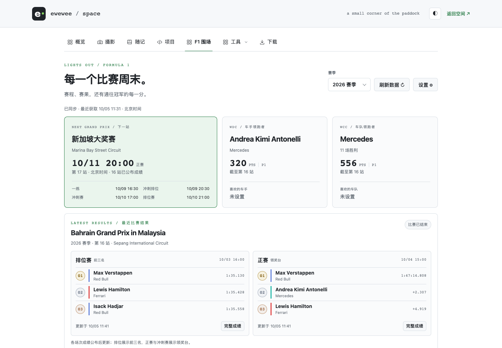

# F1赛事看板与订阅提醒

**F1 Dashboard & Race Reminders** —— 一个独立、自托管的中文 F1 数据看板。把赛程、比赛成绩、冠军积分和赛事资讯放在同一页面，并通过邮件提醒你关心的比赛。

赛事时间统一显示为**北京时间（UTC+8）**，支持深浅主题、手机和桌面浏览。公开赛事数据无需登录；喜欢的车手、主队和订阅设置保存到各自账号。

## 界面预览

[打开在线 F1 围场](https://ewewee.space/f1) · [GitHub 仓库](https://github.com/ewewee6066/f1-dashboard)



截图为 2026 年 10 月 5 日的在线展示，赛事数据会持续更新。个人网站中的 F1 围场与此独立项目共用看板功能。

## 功能

| 功能 | 内容 |
| --- | --- |
| 赛季概览 | 下一站与各场次时间、车手和车队领跑者、个人偏好积分 |
| 赛程与赛果 | 完整赛历、练习／排位／冲刺／正赛成绩、前三名与领奖台 |
| 积分榜 | WDC 车手积分、WCC 车队积分与排名 |
| 比赛手册 | 赛道地图、轮胎配方和策略、天气、发车罚退与车队升级 |
| 围场资讯 | Sky Sports 最新三条 F1 新闻标题和原文链接 |
| 订阅提醒 | 比赛周欢迎邮件、所选场次开赛前的资讯与提醒 |
| 账号 | 邮箱验证码／密码、GitHub、Google、通行密钥及账号管理 |

## 快速开始

需要 **Node.js ≥ 22.13**，推荐 Node.js 24。

```sh
npm ci
cp .env.example .env
npm start
```

打开 [http://localhost:4321/](http://localhost:4321/)。主页直接显示看板，`/f1` 保留为兼容入口。无需配置账号或邮件服务即可浏览赛事数据。

如果默认端口已被占用，将 `.env` 中的 `PORT` 改为其他端口；例如 `PORT=4322` 后访问 `http://localhost:4322/`。

## 登录与账号

页面顶部的「登录」打开登录弹窗，登录后变为「账号」。看板「设置」用于喜欢的车手、主队和比赛订阅；「管理账号」可修改昵称、绑定登录方式、设置密码或通行密钥、退出设备和注销账号。

首次创建普通账号，需要配置**邮箱验证码、GitHub 或 Google 中至少一种方式**。邮箱验证码和第三方账号首次登录时会创建账号；密码登录仅适用于已绑定邮箱并设置密码的账号。未配置的服务不显示对应入口；仓库不包含默认用户或预设密码。

- **邮箱验证码**：配置 SMTP 后开启。验证码六位、十分钟有效，绑定邮箱需重新验证当前身份。
- **邮箱密码**：先用其他方式登录，绑定并验证邮箱，再到「账号」设置 15–128 个字符的密码。忘记密码时可用邮箱验证码登录后重新设置。
- **GitHub / Google**：配置 OAuth 应用后开启。不同登录身份不会因邮箱或昵称相同而自动合并；绑定须在已登录的账号内完成。
- **通行密钥**：在 HTTPS 或 localhost 下可用，先在账号设置中添加；密钥绑定当前域名。

管理登录方式、修改密码或注销账号，需要最近五分钟内重新验证身份。管理员恢复密钥用于部署者恢复账号，不是公开注册入口；留空 `ADMIN_KEY` 时在 `DATA_DIR/admin-key.txt` 自动生成。

## 配置

复制 `.env.example` 后按需填写。账号和订阅服务可选，只有配置完整时才启用。

| 配置 | 用途 |
| --- | --- |
| `HOST` / `PORT` | 默认监听 `127.0.0.1:4321` |
| `DATA_DIR` | 默认 `./data`，保存账号、订阅和赛事缓存 |
| `PUBLIC_ORIGIN` | 外部访问的完整地址；生产环境使用 HTTPS |
| `COOKIE_SECURE` | HTTPS 部署设为 `true` |
| `GITHUB_CLIENT_ID` / `GITHUB_CLIENT_SECRET` | GitHub OAuth 登录 |
| `GITHUB_ADMIN_ID` | 可选，指定管理员的 GitHub 数字 ID |
| `GOOGLE_CLIENT_ID` / `GOOGLE_CLIENT_SECRET` | Google OAuth 登录 |
| `SMTP_HOST` / `SMTP_PORT` / `SMTP_SECURE` | 邮件服务器及传输方式 |
| `SMTP_USER` / `SMTP_PASS` / `MAIL_FROM` | 邮件认证和发件地址 |
| `AUTH_SECRET` / `ADMIN_KEY` | 可选；未填写时在数据目录生成随机密钥 |

OAuth 应用回调地址为：

```text
https://your-domain.example/api/auth/github/callback
https://your-domain.example/api/auth/google/callback
```

实际地址需与 `PUBLIC_ORIGIN` 一致。Google 登录只请求身份基本信息，不读取 Gmail 或 Drive。

### 邮件配置示例

```dotenv
SMTP_HOST=smtp.example.com
SMTP_PORT=587
SMTP_SECURE=false
SMTP_USER=
SMTP_PASS=
MAIL_FROM=F1 Dashboard <reminders@example.com>
```

请替换为邮件服务提供的实际配置。587 使用 STARTTLS，465 通常设 `SMTP_SECURE=true`。正式环境要求加密传输，发件域名的 SPF / DKIM 按邮件服务要求配置。

## 订阅比赛提醒

1. 登录账号，绑定并验证收件邮箱。
2. 打开「设置」，选择邮箱和订阅内容：练习、排位、冲刺、冲刺排位或正赛。
3. 开启订阅并保存。首次启用会发送一封最近比赛周末的完整测试邮件；缺少的资料明确标注为排版示例。

| 邮件 | 发送时间（北京时间） |
| --- | --- |
| 比赛周欢迎邮件 | 比赛周周四 09:00 |
| 所选场次提醒 | 开赛前 30 分钟 |

邮件包含赛程、赛道和比赛手册、新闻与已公布成绩。提醒由持续运行的 Node 服务自动排程，无需额外 cron。服务停止期间不会发送邮件；重新启动后不保证补发所有错过的提醒。可在设置中关闭订阅，解绑收件邮箱会自动关闭相关订阅。

## 数据来源与更新

| 来源 | 用途 |
| --- | --- |
| [Jolpica-F1](https://github.com/jolpica/jolpica-f1) | 赛历、比赛成绩与积分 |
| Formula 1 官方网站 | 官方成绩、赛道地图和赛事资料 |
| OpenF1 / MultiViewer | 补充赛事与赛道资料 |
| FIA / Pirelli | 公开赛事文件、处罚、升级与轮胎资讯 |
| [Open-Meteo](https://open-meteo.com/) | 赛道当地天气 |
| [Sky Sports F1](https://www.skysports.com/f1/news) | 最新三条新闻标题和原文链接 |

赛事数据缓存十五分钟，新闻缓存一小时；请求串行限速、合并并发并在限流后退避。来源不可用时展示标有时间的缓存或提示不可用，不把排版示例当作正式赛果。成绩以来源公布为准，本项目不提供比赛实时计时，也不是 F1 官方网站。

## 部署、数据与备份

生产环境通过 HTTPS 反向代理访问 Node 服务，配置实际 `PUBLIC_ORIGIN` 并启用 `COOKIE_SECURE`。需要读取真实客户端 IP 时，设置 `TRUST_PROXY_IPS`，并确保可信代理覆盖相应请求头。Cloudflare Tunnel 可配合 `CLOUDFLARE_TUNNEL` 使用。

运行数据在 `DATA_DIR`：SQLite 账号与订阅数据、认证和恢复密钥、赛事缓存及地图缓存。不要提交 `.env`、数据目录、数据库、真实邮件记录或密钥。备份与迁移时先停止服务，再复制整个数据目录；恢复后确保进程可读写。更换域名后需要重新绑定通行密钥。

## 测试

```sh
npm test
npm run test:ui
```

浏览器测试使用已安装的 Google Chrome。测试在临时目录使用虚构账号、模拟赛事和本地 SMTP，覆盖缓存、来源校验、比赛资料、账号隔离、偏好保存、订阅发送与重试，以及登录和手机布局；不会读取生产账号或发送真实邮件。

## 许可

原创代码使用 [MIT License](LICENSE)，第三方依赖及数据说明见 [NOTICE.md](NOTICE.md)。上游数据、图片、商标、新闻和赛事文件属于各自权利人，代码许可证不授予这些内容的使用权。
